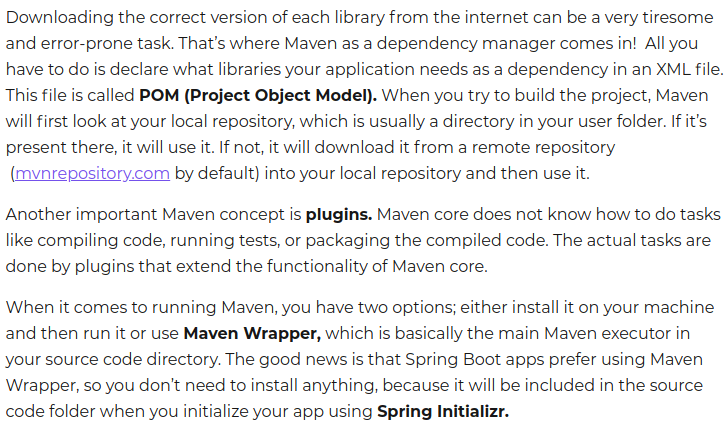
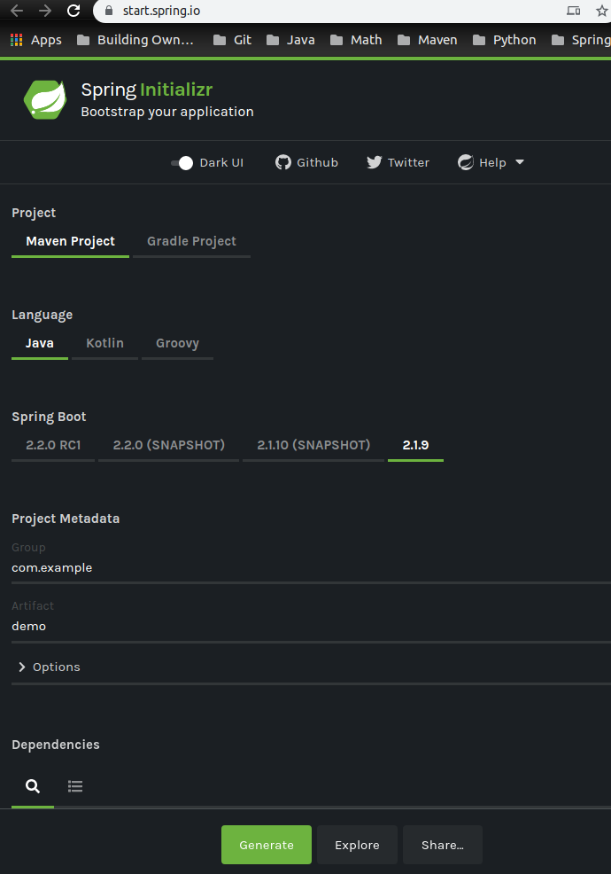
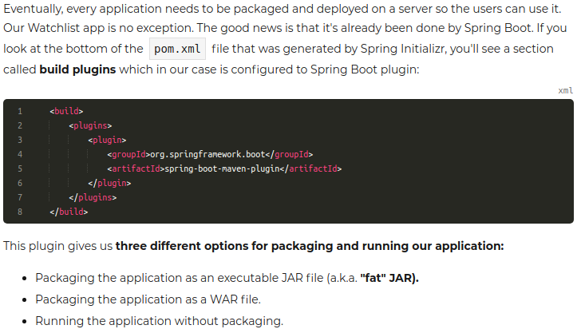
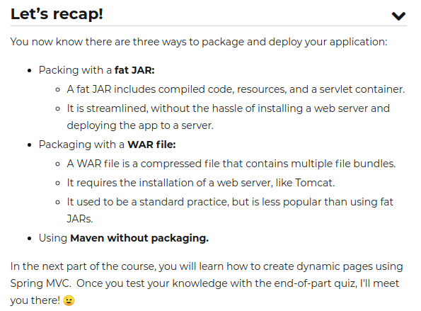

## What is Spring?
- before, one had to follow complex specifications set out by J2EE
- Spring was born to combat all this
- has grown into a family of 20 projects that provide solutions for common challenges that come up when developing modern enterprise applications

**Enterprise applications:**
- applications built for large companies requiring larger, more complex solutions

## Reasons to use Spring
- **Modular architecture**
  - pick and choose whatever you want
- **Testability**
  - promotes loosely coupled components
  - this is essential for testability of an app
  - also provides many helper test classes making unit testing spring apps easier
- **Boilerplate code reduction**
  - reduction in code you copy and paste to get things working
- **Well designed web framework**
  - spring MVC is a powerful and flexible framework
  - any **template engine** can be used for generation of HTML pages
  - easily testable
  - makes it easier to factor out common behavior when processing different requests (reducing code duplication)

## What is Spring Boot?
- Built on top of Spring
- follows **Convention over Configuration** principle
  - which removes the need for manual configuration unless it is necessary
- Essentially, a spring simplifier

**Convention over configuration:**
- design principle that some frameworks follow by seeking to minimize the number of decisions a developer has to make
- this is done by having a framework with some default configurations
- only unconventional configurations are specified


### Spring Boot also offers:
- **Embedded Servlet container**
  - Traditionally, code had to be packaged and then deployed to an HTTP server
  - **_Now we can package our spring boot web app in a jar file with an embedded web server_**
  - This has made Spring Boot the number one choice for developing microservices


## Maven Overview
- Spring relies a lot on Build tools to deliver a lot of its values
- We will use Maven to build and configure our app


**_Maven is a Java build tool and dependency management tool capable of:_**
- compiling source code
- Running tests
- packaging result into .jar or .war
- Deploying the results to a server


For compiling code, applications usually need many .jar files from 3rd party libraries to be present on the **classpath**
<br>

**Classpath:**
* a parameter that tells Java compiler where to look for user-defined libraries



---

## Creating a project using Spring Initializr

- go to https://start.spring.io/
- click generate after specifying details of springboot project





## Preparing HTML front end
- we will get pre made static HTML pages from a repo


- add home page to `src/main/resources/templates` and rename it `index.html`
<br>
- Add thymeleaf dependency to POM.xml
```xml
<dependency>
  <groupId>org.springframework.boot</groupId>
  <artifactId>spring-boot-starter-thymeleaf</artifactId>
</dependency>
```
##Package and run your app




## The new method: Packaging a fat jar
- a JAR is created that includes our compiled code, resources and a **servlet container** like tomcat
- that is why it is called an executable fat JAR
- all you have to do to run the JAR file is java -jar <application-name>.jar
- Before spring boot, a separate web server had to be installed and maintained and the app had to be deployed to the server

## The old and ugly: Packaging a WAR file
- Creating a **WAR** (web application **ar**chive) then deploying it to a server used to be the only way to run a Java web app
- It is still supported but it is a thing of the past
- A **WAR** is a single compressed file that contains multiple files bundled inside it.



