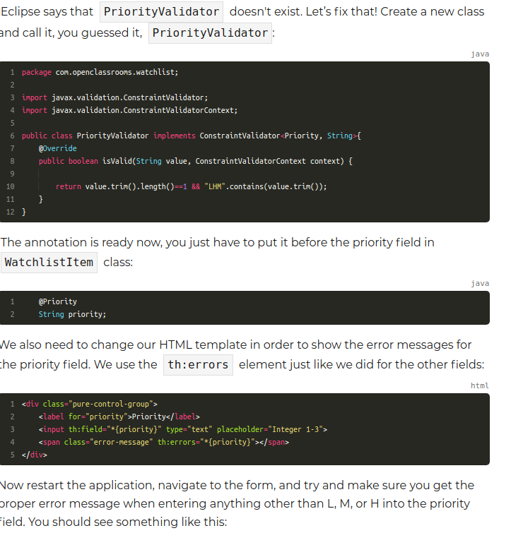

# MVC
* a design pattern that divides a user interface into three separate components

  **Model**:

    - objects contains the data to be displayed to the user

  **View**:
  - a visual representation of the data (HTML)

  **Controller**:
  - receives user requests and changes the state of the model


     

---


# Understanding Spring MVC Architecture
- the Architecture of spring mvc consists of a few cleanly separated components
- these components have well defined responsibilities
- Any of these component can be configured


####  Let's review how web apps work to understand Spring MVC
<br>

- Sole purpose of web app is to serve web requests
- HTTP requests are received and responses sent back

#### Analogy: A web app is like a marketing firm that serves its clients
<br>

1. request for new ad comes in
2. director/coordinator finds someone specialized in the content type of requested ad
3. director/coordinator asks them to come up with ideas
4. director takes ideas to graphic designers
5. graphic designer generates content for client
6. Finally, director hands result to client


#### Spring MVC follows a similar workflow to serve HTTP requests
<br>


* **DispatcherServlet** is at the center of Spring MVC


<br>

#### Function of **DispatcherServlet**
<br>

Overview:
- receives HTTP request from browser and coordinates all major components of Spring MVC to produce response for browser


Detailed:
1. A request from a web browser is sent to our Watchlist application. For example, an `HTTP GET`  request to the URL  `/Watchlist`. This request will be received by the DispatcherServlet.

2. The DispatcherServlet asks **handler mappings** to see which method of which class is responsible for processing this request. A handler mapping is like a database or a person who has records of each person’s responsibility in a company. It also maps incoming requests to **handler methods**. A handler method is a method in a Java class that handles incoming HTTP requests. The Java class that contains these methods is called a **controller class**.

3. Handler mappings send back the handler method's details to the DispatcherServlet.

4. Now that DispatcherServlet knows which method is responsible for handling this request, it makes a call to that method. The HTTP request data will also be passed to the handler method as parameters.

5. The handler method (which is written by us) processes the input. For example, it loads the name of the movies in the user’s watch list based on the input, and returns two things to the dispatcher: the name of the HTML template (view), e.g.,  watchlist.html and the data needed to render it (model), e.g., a list of watch list items.

6. Dispatcher gives the view name to the **view resolver** to get the actual view content.

7. View resolver returns the actual HTML template content back. Note that views are also written by developers while other components are parts of the framework.

8. Dispatcher gives the model and view to the **view engine** (Thymeleaf **template engine**, for example).

9. View engine merges the view template with the data and produces plain old HTML and sends it back to DispatcherServlet.

10. Finally, DispatcherServlet sends the generated HTML back to the browser.

---
# Template engine
* A program used to combine your HTML or front end code with data from the backend in order to create dynamic web pages

#### Template Engine Analogy to weeding invitations
<br>

* A wedding invitation has a specific structure (wording, paragraphs and images) but blanks are left to personalize each invitation to each attendee
* the attendee's name is filled in an invitation
* **_each attendee's name is the model/data and the raw letters are the view templates and the person/computer that merges both is the template engine_**

#### Template engine in the context of web apps
<br>

- An engine parses HTML pages that contain special tags or attributes bound to variables (template language, which is special language found embedded within a document)
- It resolves/replaces those variables with their values based on data passed into template engine
- The special tags in the HTML template are replaced with actual data to produce a normal HTML page that does not possess these special tags (template language)

<br>


## Create your first Dynamic page
- let's make the total number of items displayed in the html page dynamic
- Adding a new page or functionality to Spring MVC usually involves
  - **Adding a handler method to a new or existing controller class** to handle incoming requests and prepare and return the model and view name
  - **Creating an HTML template (view) to be rendered** with data in the model object after the request is processed

#### Add the controller class and handler methods

- we need a method to handle browser's GET requests coming to `/watchlist` URL
- Each handler method should return:
  - The **Model**
  - The **view name**
- These two are returned as an instance of the class `ModelAndView`

Two important annotations needed:
- `@Controller`
  - Is put at the top of the class (class level annotation)
  - Tells **Handler mappings** that the methods in this class are handler methods
- `@RequestMapping(method = RequestMethod.GET, value ="/")`
  - method level annotation
  - means that the method can handle `HTTP GET` requests at the specified URI
  - This info is gathered by handler mappings

#### Thymeleaf Attributes
- we will use thymeleaf to turn static HTML page to dynamic
- **thymeleaf relies on attributes that we add to HTML tags**
- These attributes will be interpreted by the Thymeleaf engine to replace the content of the tag with values generated based on the data in the model

Ex:
- `th:text` is one of these thymeleaf attributes
```HTML
<div>Number of movies to watch:  <span th:text="${numberOfMovies}"> </div>	 

```
- we pass a model object that contains a value called "numberOfMovies" that is mapped to the number of movies
-  Thymeleaf engines process the statement inside the th:text attribute and adds the value of numberOfMovies, seen below. (1234)

```java
package com.openclassrooms.watchlist;

import java.util.HashMap;
import java.util.Map;

import org.springframework.stereotype.Controller;
import org.springframework.web.bind.annotation.GetMapping;
import org.springframework.web.servlet.ModelAndView;

@Controller
public class WatchlistController {

	@GetMapping("/watchlist")
	public ModelAndView getWatchlist() {

		String viewName = "watchlist";

		Map<String, Object> model = new HashMap<String, Object>();

		model.put("numberOfMovies", "1234");

		return new ModelAndView(viewName , model);
	}
}
```


#### Adding Thymeleaf dependency
- Add dependency to pom.xml
```xml
<dependency>
      <groupId>org.springframework.boot</groupId>
      <artifactId>spring-boot-starter-thymeleaf</artifactId>
</dependency>
```

Make sure thymeleaf is added to the namespace of the HTML document:

```HTML
<html xmlns:th="http://www.thymeleaf.org">

```

---

#Handle form submissions
- It's great to show some data to a user like in the previous chapter, but we also need to receive data in our application so users can enter the name of the movies they want to watch. We’ll do this by implementing a web form.
- What is a **web form?**


-Implementing web forms usually consists of two main steps
1. **Displaying** a prepopulated or empty form to the user
2. **Receiving** the submitted data and redirecting it to another page


- Use command objects both
  - when the form loads
  - when it is submitted
- before a web form loads, put a command object (either empty or prepopulated) in the model (a map)


```html
<html xmlns:th="http://www.thymeleaf.org">
   <head>
      <!-- Meta tags -->
      <meta charset = "utf-8">
      <meta name = "viewport" content = "width = device-width, initial-scale = 1, shrink-to-fit = no">
      <link rel = "stylesheet" href = "https://stackpath.bootstrapcdn.com/bootstrap/4.1.3/css/bootstrap.min.css">

      <title>Watchlist App</title>
   </head>

   <body>
      <div class = "container">
 		<nav class = "navbar navbar-expand-sm navbar-dark bg-secondary">
            <a class = "navbar-brand" href = "homepage-static.html">Watchlist App</a>
            <button class = "navbar-toggler" type = "button" data-toggle = "collapse"
               data-target = "#navbarSupportedContent"
               aria-controls = "navbarSupportedContent" aria-expanded = "false"
               aria-label = "Toggle navigation">
               <span class = "navbar-toggler-icon"></span>
            </button>

            <div class = "collapse navbar-collapse" id = "navbarSupportedContent">
               <ul class = "navbar-nav mr-auto">
                  <li class = "nav-item">
                     <a class = "nav-link" href = "/">Home</a>
                  </li>
                  <li class = "nav-item">
                     <a class = "nav-link" href = "/watchlist">Watchlist</a>
                  </li>
                  <li class = "nav-item active">
                     <a class = "nav-link" href = "/watchlistItemForm">Submit an item</a>
                  </li>
               </ul>
            </div>
      	</nav>         
         <form action="#" method="post" th:action="@{/watchlistItemForm}" th:object="${watchlistItem}">
            <h2 class = "mt-4">Submit an item</h2>
            <hr/>
            <div class = "form-group row ">
               <label for = "title" class = "col-sm-2 col-form-label">Title</label>
               <div class = "col-sm-4">
                  <input th:field="*{title}" type = "text" class = "form-control" placeholder = "Mandatory">
               </div>
            </div>

            <div class = "form-group row ">
               <label for = "rating" class = "col-sm-2 col-form-label mr-0">Rating</label>
               <div class = "col-sm-4">
                  <input th:field="*{rating}" type = "text" class = "form-control" placeholder = "5.0 < Number < 10.0">
               </div>
            </div>

            <div class = "form-group row ">
               <label for = "priority" class = "col-sm-2 col-form-label mr-0">Priority</label>
               <div class = "col-sm-4">
                  <input th:field="*{priority}" type = "text" class = "form-control" placeholder = "Low|Medium|High">
               </div>
            </div>

            <div class = "form-group row">
            	<label for = "comments" class = "col-sm-2 col-form-label">Comments</label>
            	<div class = "col-sm-4">
               		<textarea th:field="*{comment}" class = "form-control" rows = "3" placeholder = "Max. 50 chars"></textarea>
               </div>
            </div>

            <div class = "form-group row">
               <div class = "col-sm-10">
                  <button type = "submit" class = "btn btn-primary">Submit</button>
               </div>
            </div>
         </form>

      </div>
      <script src = "https://code.jquery.com/jquery-3.3.1.slim.min.js"> </script>
      <script src = "https://cdnjs.cloudflare.com/ajax/libs/popper.js/1.14.3/umd/popper.min.js" > </script>
      <script src = "https://stackpath.bootstrapcdn.com/bootstrap/4.1.3/js/bootstrap.min.js" > </script>
   </body>
</html>

```


## @RequestParam
- **this annotation is used to bind query parameter values found in the query string of a request to the controller method parameters**
- https://www.baeldung.com/spring-request-param


####Using @RequestParam to bind id from query parameters to controller method argument

- When update button is pressed, we want to send id of the movie selected to /watchlistItemForm GET handler method to determine whether if a new, empty watchlistItem should be tied to the form, or an existing watchlistItem, if the movie is an existing one with a current id that is not null, we want to display its existing data in the form so we can update


- `@RequestMapping` is used to bind the query parameter to a method parameter that the handler method can use, here called id.
- `required = false` is needed because when we click the tab "submit form", an HTTP GET request is made to `/watchlistItemForm` without query parameters (as specified in the `href` attribute `anchor tag` element in HTML of `watchlist.html` seen below)

- Not having required set to false would cause an error unless we specify that the request parameter that is binded to the handler method parameter is not required


```java
@RequestMapping(method = RequestMethod.GET, value ="/watchlistItemForm")
    public ModelAndView showWatchListItemForm(@RequestParam(required = false) Integer id){
    }

```

#### How does the Query parameter id get sent from watchlist.html using Thymeleaf when we hit submit?

```HTML
</tr>
			<tr th:each="watchlistItem : ${watchlistItems}">
				<td><span th:text="${watchlistItem.title}"> Title </span></td>
				<td><span th:text="${watchlistItem.rating}"> Author </span></td>
				<td><span th:text="${watchlistItem.priority}"> Author </span></td>
				<td><span th:text="${watchlistItem.comment}"> Author </span></td>
<!--				Passes the id of the watchlistItem selected for update to the handler method that handles GET requests at /watchlistItemForm as a query parameter, @request parameter in handler method extracts the query into a POJO variable that handler method can use-->
				<td><a href="#" class="btn btn-info" role="button" th:href="@{/watchlistItemForm(id=${watchlistItem.id})}">Update</a></td>

			</tr>
```

---

##Form Field Validation


- **form validation:** web app gives feedback when data is incorrectly entered in a form
- Ex: title can not be empty, rating has to be within range, etc
- We will focus on **field validations** in this chapter


####Use validation annotations
- **Field  validation is about making sure a single field has the correct format**
- ex:
  - field can not be empty
  - has to be within range
  - email address needs conventional format


### **To implement validations, we need to change three points in the code:**
1. **command object**
   - add validation annotations
2. **controller class**
   - check validation results before going ahead with the operation
3. **HTML template**
   - show error message returned by Spring


#### In the command object
- add valid annotations to fields in model object class

```Java
package com.openclassrooms.watchlist;

import javax.validation.constraints.NotBlank;
import javax.validation.constraints.Size;

public class WatchlistItem {

	private Integer id;

	@NotBlank( message="Please enter the title")
	private String title;

	private String rating;

	private String priority;

	@Size(max=50,  message="Comment should be maximum 50 characters")
	private String comment;
	// rest of the class unchanged
```
#### In the controller class
1. add `@valid` WatchlistItem watchlistItem
   - This ensures that the fields in the command object are validated
2. add an extra parameter called `BindingResult` which is passed in the `POST` request
   - This carries the result of the validation operation


```Java
@PostMapping("/watchlistItemForm")
public ModelAndView submitWatchlistItemForm(@Valid WatchlistItem watchlistItem, BindingResult bindingResult) {

  if (bindingResult.hasErrors()) {
          return new ModelAndView("watchlistItemForm");
      }
      // rest of the method unchanged
```


####In the HTML Template


#### Result


### Custom validations with custom annotations
- sometimes the standard annotations are not enough
- let's validate the rating field so it is between 1-10
- let's validate the priority field and limit input values to L, M, or H

Each custom validation has two components that need to be implemented together:
1. The annotation itself
2. The validator class where the actual validation logic happens





