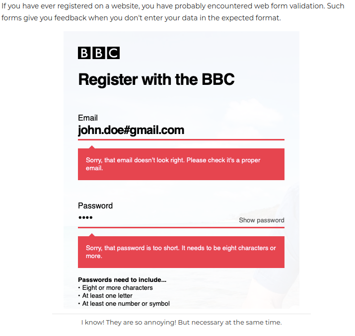
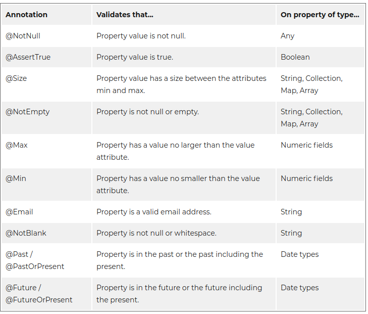
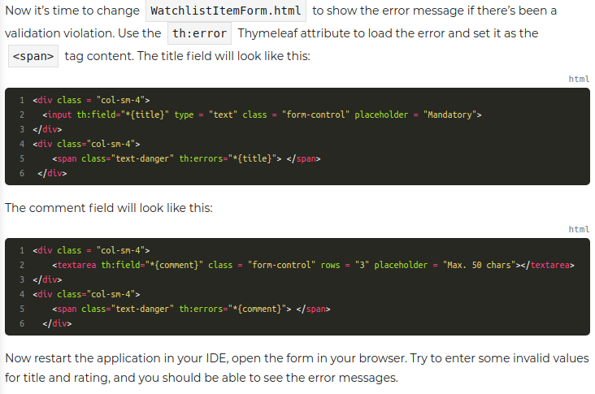
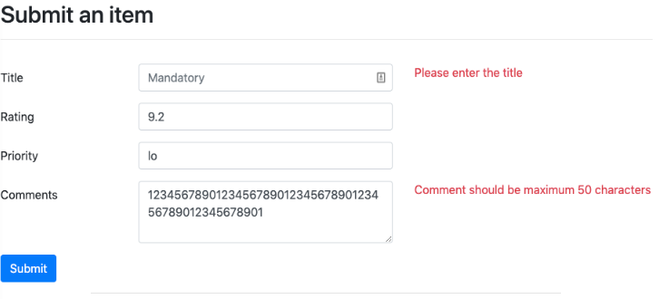

# @Valid
- Used for validating fields in a form tied to a command object, an object that represents the field of a form
- Used along side standard validation annotations and custom validation annotations
- Annotation added to parameter of handler method

##Form Field Validation


- **form validation:** web app gives feedback when data is incorrectly entered in a form
- Ex: title can not be empty, rating has to be within range, etc
- We will focus on **field validations** in this chapter


####Use validation annotations
- **Field  validation is about making sure a single field has the correct format**
- ex:
  - field can not be empty
  - has to be within range
  - email address needs conventional format




### **To implement validations, we need to change three points in the code:**
1. **command object**
   - add validation annotations
2. **controller class**
   - check validation results before going ahead with the operation
3. **HTML template**
   - show error message returned by Spring


#### In the command object
- add valid annotations to fields in model object class

```Java
package com.openclassrooms.watchlist;

import javax.validation.constraints.NotBlank;
import javax.validation.constraints.Size;

public class WatchlistItem {

	private Integer id;

	@NotBlank( message="Please enter the title")
	private String title;

	private String rating;

	private String priority;

	@Size(max=50,  message="Comment should be maximum 50 characters")
	private String comment;
	// rest of the class unchanged
```
#### In the controller class
1. add `@valid` WatchlistItem watchlistItem
   - This ensures that the fields in the command object are validated
2. add an extra parameter called `BindingResult` which is passed in the `POST` request
   - This carries the result of the validation operation


```Java
@PostMapping("/watchlistItemForm")
public ModelAndView submitWatchlistItemForm(@Valid WatchlistItem watchlistItem, BindingResult bindingResult) {

  if (bindingResult.hasErrors()) {
          return new ModelAndView("watchlistItemForm");
      }
      // rest of the method unchanged
```


####In the HTML Template



#### Result

